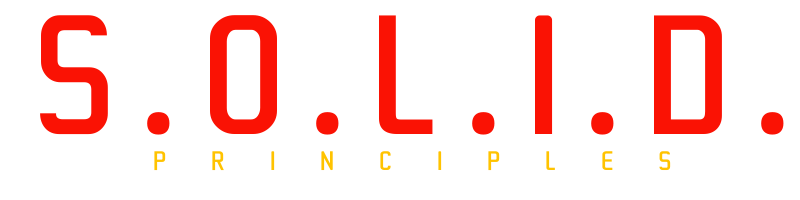

    

    

[SOLID](https://www.digitalocean.com/community/conceptual_articles/s-o-l-i-d-the-first-five-principles-of-object-oriented-design) is one of the most popular design principles in object-oriented software development. It is a mnemonic abbreviation of the following five design principles:

- [**S**ingle Responsibility Principle](https://www.digitalocean.com/community/conceptual_articles/s-o-l-i-d-the-first-five-principles-of-object-oriented-design#single-responsibility-principle): a class should have one and only one reason to change, meaning that a class should have only one job.

- [**O**pen/Closed Principle](https://www.digitalocean.com/community/conceptual_articles/s-o-l-i-d-the-first-five-principles-of-object-oriented-design#open-closed-principle): objects or entities should be open for extension but closed for modification.

- [**L**iskov Substitution Principle](https://www.digitalocean.com/community/conceptual_articles/s-o-l-i-d-the-first-five-principles-of-object-oriented-design#liskov-substitution-principle): let q(x) be a property provable about objects of x of type T. Then q(y) should be provable for objects y of type S where S is a subtype of T.

- [**I**nterface Segregation Principle](https://www.digitalocean.com/community/conceptual_articles/s-o-l-i-d-the-first-five-principles-of-object-oriented-design#interface-segregation-principle): a client should never be forced to implement an interface that it doesn’t use, or clients shouldn’t be forced to depend on methods they do not use.

- [**D**ependency Inversion Principle](https://www.digitalocean.com/community/conceptual_articles/s-o-l-i-d-the-first-five-principles-of-object-oriented-design#dependency-inversion-principle): entities must depend on abstractions, not on concretions. It states that the high-level module must not depend on the low-level module, but they should depend on abstractions.

Different software languages in the Example folder have code snippets that show how applying SOLID principles affects code design.

For each principle, there are two files in the Sources folder;

 - **bad** files: a default implementation of sample case

 - **good** files: related principle applied version of the case

to show the difference in a simple and clear way.
